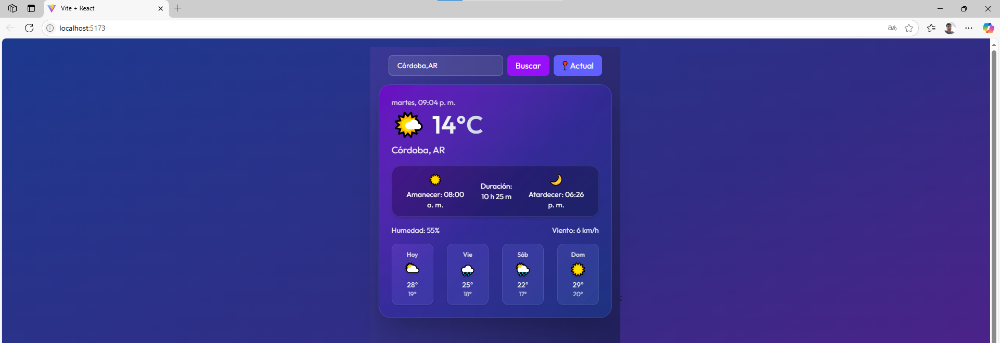

# WeatherWidget 🌦️

Una aplicación moderna construida con **React** que permite visualizar el clima actual de cualquier ciudad del mundo en tiempo real, utilizando la API de **OpenWeatherMap**. El diseño es responsivo y atractivo, con animaciones y detalles visuales inspirados en aplicaciones móviles actuales.

## 📷 Captura de pantalla
<picture></picture>

## ✨ Características

- 🔍 **Búsqueda por ciudad**: permite consultar el clima de cualquier ciudad ingresada.
- 📍 **Selección en mapa (en desarrollo)**: planeado para elegir ubicaciones directamente desde un mapa interactivo (proximamente).
- 📆 **Información detallada**:
  - Temperatura actual en °C
  - Humedad y velocidad del viento
  - Horas de amanecer y atardecer
  - Duración del día
- 📅 **Pronóstico extendido (estático por ahora)** para los próximos días.
- 🌈 **Estética moderna** con degradados, sombras suaves, y soporte para dispositivos móviles.

♿ Accesibilidad y Buenas Prácticas WCAG
Este proyecto incorpora buenas prácticas de accesibilidad basadas en las pautas WCAG para hacer la experiencia más inclusiva para personas con diferentes necesidades visuales y de interacción.

Funcionalidades de accesibilidad implementadas
Contraste aumentado para mejor lectura.

- Filtros para simulación de daltonismo (Deuteranopía, Protanopía, Tritanopía) para usuarios con dificultad para distinguir colores.

- Opciones visuales para astigmatismo, texto grande, espaciado de texto y altura de línea, facilitando la lectura.

- Detención de animaciones para personas sensibles a movimientos.

- Lectura automática del texto visible en pantalla mediante síntesis de voz (speechSynthesis).

- Resaltado de enlaces y ocultado de imágenes para usuarios con necesidades específicas.

- Persistencia de las opciones seleccionadas usando localStorage para mantener configuraciones entre sesiones.

- Menú accesible y fácil de usar para activar o desactivar estas opciones en cualquier momento.

## 🚀 Tecnologías

- [React](https://reactjs.org/)
- [ReacRouterDoom](https://www.npmjs.com/package/react-router-dom)
- [Tailwind CSS](https://tailwindcss.com/)
- [OpenWeatherMap API](https://openweathermap.org/api)

- Uso de React con hooks personalizados para manejar las opciones de accesibilidad.

- Aplicación dinámica de clases CSS para activar filtros y estilos.

- Uso de filtros CSS para simular condiciones de daltonismo sin necesidad de SVG externos.

- Sintetizador de voz nativo del navegador para lectura de texto.

## 🧑‍💻 Instalación

#### clona el repositorio
- git clone https://github.com/Aubar48/app-clima-react
#### moverte por consola al projecto
- cd app-clima-react-master
#### instalar dependencias
- npm install
#### agregar tu propia api key en el archivo .env tenes el ejemplo del archivo .env.example
- VITE_OPENWEATHER_API_KEY=
#### iniciar app
- npm run dev
- Abre en el navegador de forma local: http://localhost:5173
- Ver online: https://appclimanahuel.netlify.app/

## 🗺️ Próximas mejoras
- 🧭 Búsqueda geográfica con mapa interactivo (leaflet o Mapbox).

