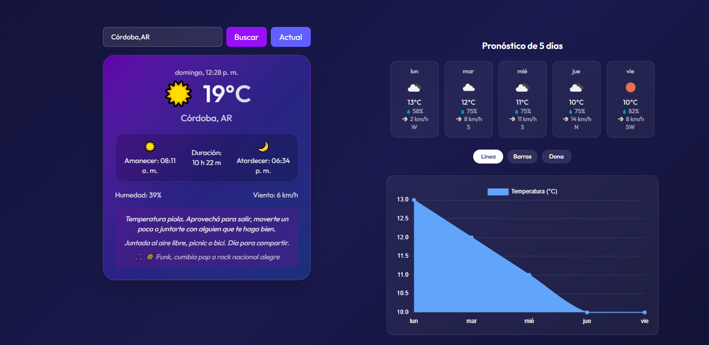

# WeatherWidget 🌦️

Una aplicación moderna construida con **React** que permite visualizar el clima actual de cualquier ciudad del mundo en tiempo real, utilizando la API de **OpenWeatherMap**. El diseño es responsivo y atractivo, con animaciones y detalles visuales inspirados en aplicaciones móviles actuales.

## 📷 Captura de pantalla
<picture></picture>


## ✨ Características

- 🔍 **Búsqueda por ciudad**: permite consultar el clima de cualquier ciudad ingresada.
- 📍 **Selección en mapa (en desarrollo)**: planeado para elegir ubicaciones directamente desde un mapa interactivo.
- 📆 **Información detallada**:
  - Temperatura actual en °C
  - Humedad y velocidad del viento
  - Horas de amanecer y atardecer
  - Duración del día
- 📅 **Pronóstico extendido (estático por ahora)** para los próximos días.
- 🌈 **Estética moderna** con degradados, sombras suaves, y soporte para dispositivos móviles.

## 🚀 Tecnologías

- [React](https://reactjs.org/)
- [Tailwind CSS](https://tailwindcss.com/)
- [OpenWeatherMap API](https://openweathermap.org/api)

## 🧑‍💻 Instalación

1. **Clona este repositorio**:

   ```bash
#### clona el projecto
- git clone https://github.com/Aubar48/app-clima-react
#### moverte por consola al projecto
- cd weather-widget
#### instalar dependencias
- npm install
#### agregar tu propia api key o usar la que esta por defecto que esta en el componente WeatherWidget.
- const API_KEY = "TU_API_KEY_AQUI";
#### iniciar app
- npm run dev
- Abre en el navegador: http://localhost:5173
- Ver online: https://appclimanahuel.netlify.app/

## 🗺️ Próximas mejoras
- 🧭 Búsqueda geográfica con mapa interactivo (leaflet o Mapbox).

- 📊 Pronóstico real para próximos días usando /forecast de OpenWeatherMap.

- 🌐 Soporte para ubicación automática por geolocalización.

- 🌓 Modo oscuro/oscuro automático por hora del día.


